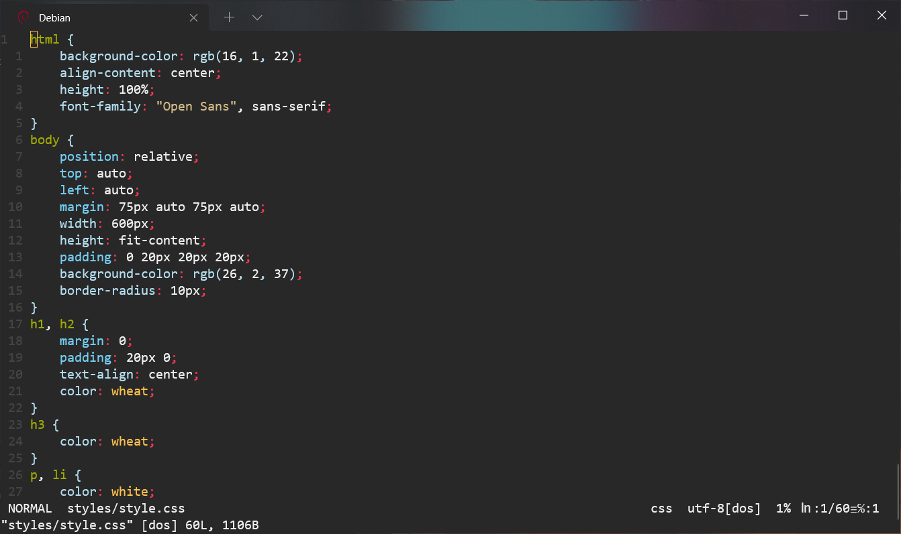

<p align=center>
	
</p>

<h1 align="center">The Essential vimrc for Developers</h1>

This Vim configuration contains a basic setup for developers (a number of handy plugins, keybindings and colorschemes that make your Vim a "pro" editor).
## How to install
Clone the repository:
```
git clone https://github.com/TMKE/pro-vim.git ~/.vim
```
Move `.vimrc` file to the `~` directory:
```
mv ~/.vim/.vimrc ~/
```
Type the following command inside Vim in order to install plugins:
```
:PlugInstall
```
## Screenshots


## Included Plugins
To take full advantage of these plugins, you should read the documentation.
- [limelight.vim](https://github.com/junegunn/limelight.vim): Focus on current paragraphe when writing
- [coc.nvim](https://github.com/neoclide/coc.nvim): Plugin for autocompletion
- [lightline.vim](https://github.com/itchyny/lightline.vim): Add lightline status line
- [indentLine](https://github.com/Yggdroot/indentLine): A vim plugin to display the indention levels with thin vertical lines
- [nerdtree](https://github.com/preservim/nerdtree): A tree explorer plugin for vim
- [vim-visula-multi](https://github.com/mg979/vim-visual-multi): Multiple cursors plugin for vim/neovim
- [vim-gitgutter](https://github.com/airblade/vim-gitgutter): A Vim plugin which shows git diff markers in the sign column and stages/previews/undoes hunks and partial hunks
- [vim-commentary](https://github.com/tpope/vim-commentary): A plugin to comment stuff out
- [vim-surround](https://github.com/tpope/vim-surround): Delete/change/add parentheses/quotes/XML-tags/much more with ease
- [vim-fugitive](https://github.com/tpope/vim-fugitive): Plugin for Git (call Git commands)
- [fzf](https://github.com/junegunn/fzf): A command-line fuzzy finder
- [fzf.vim](https://github.com/junegunn/fzf.vim): A a bundle of fzf-based commands and mappings
- [ultisnips](https://github.com/SirVer/ultisnips): The ultimate solution for snippets in Vim
- [vim-smoothie](https://github.com/psliwka/vim-smoothie): Smooth scrolling in Vim
- [auto-pairs](https://github.com/jiangmiao/auto-pairs): Insert or delete brackets, parens, quotes in pair
- [vim-closetag](https://github.com/alvan/vim-closetag): Auto close HTML tags
### Plugins for syntax highlighting
- [vim-polyglot](https://github.com/sheerun/vim-polyglot): Language pack for Vim
- [yats.vim](https://github.com/HerringtonDarkholme/yats.vim): TypeScript syntax highlighting in Vim
- [vim-javascript](https://github.com/pangloss/vim-javascript): Improved Javascript indentation and syntax support in Vim
- [vim-jsx-pretty](https://github.com/MaxMEllon/vim-jsx-pretty): JSX and TSX syntax pretty highlighting
- [vim-styled-components](https://github.com/styled-components/vim-styled-components)
- [vim-json](https://github.com/elzr/vim-json): JSON syntax highlighting
- [vim-graphql](https://github.com/jparise/vim-graphql): A Vim plugin that provides GraphQL file detection, syntax highlighting, and indentation
- [vim-go](https://github.com/fatih/vim-go): Go development plugin for Vim 
- [kotlin-vim](https://github.com/udalov/kotlin-vim): Kotlin plugin for Vim
- [dart-vim-plugin](https://github.com/dart-lang/dart-vim-plugin)
- [vim-flutter](https://github.com/thosakwe/vim-flutter)
## Included Colorschemes
- [blackbirdtheme](https://github.com/blackbirdtheme/vim)
- [srcery-vim](https://github.com/srcery-colors/srcery-vim)
- [vim-brogrammer-theme](https://github.com/marciomazza/vim-brogrammer-theme)
- [vim-monokai-tasty](https://github.com/patstockwell/vim-monokai-tasty)
- [tender.vim](https://github.com/jacoborus/tender.vim)
- [sonokai](https://github.com/sainnhe/sonokai)
- [tokyonight-vim](https://github.com/ghifarit53/tokyonight-vim) 
- [simpleblack](https://github.com/lucasprag/simpleblack) 
- [vim-hemisu](https://github.com/noahfrederick/vim-hemisu)
- [onedark.vim](https://github.com/joshdick/onedark.vim) (default)
- [vim-monokai-pro](https://github.com/phanviet/vim-monokai-pro)
## Key Mappings
### Normal Mode
- The leader key (`<leader>`) is remaped to `,` instead of `\`.
- `F5`: toggle NERDTree
- `Backspace`: delete characters behind the cursor
- `Tab`: Move between buffers
- `Y`: yank from the current position until the end of the line (equivalent of `y$`)
- `<leader>` (i.e. `,`) then `tn`: open a new tab (instead of `:tabnew`)
- `<leader>`, `t` then `<leader` again: move to the next tab (instead of `:tabnext`)
- `<leader>` then `tm`: move a tab (instead of `:tabmove`)
- `<leader>` then `tc`: close a tab (instead of `:tabclose`)
- `<leader>` then `to`: close all tab pages except the current one (instead of `:tabonly`)
- `<leader>` then `k`/`j`: move current line up/down
- `<leader>` then `w`: move between splits
### Visual Mode
- `K`/`J`: move the current line (or multiple lines selected) up/down
### Insert Mode
- `Ctrl`+`k`/`j`: move current line up/down
- `Tab`: indent (`Tab`+`Shift` to unindent)
